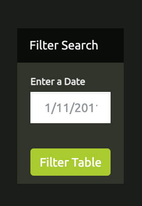

# javascript-challenge
The challenge: use JavaScript to create a filterable, by date, UFO sightings table. Provided was a web page template, css file, the UFO data, and a blank app.js file to write the code in.

## UFO-level-1

**Website Image**

So diving in, the first step was to create the table of sightings on the web page. I used d3 to select the tbody tag and append rows and cells for each of the key/value pairs in the data dictionary.

**Search Form**

Next, was to select the filter button as well as the form in order to create event handlers for a user to click and submit a date they would like to filter the data by. I selected the input id off the form, and used the date value they entered to filter the table data and create a new variable with only the data requested. I then re-ran the same code as before, using the d3 to select the tbody tag and append the new data to the rows and cells. 

One challenge I ran into was realizing the info was appending to the end of the table I had already created. What I needed to do was select and remove the previous table before rewriting the new filtered data to the web page. Then everything worked great!

Lastly, I worked with the CSS code to update the design of the web page, overriding many of the Bootstrap css defaults. I updated colors, found a new image, formatted the look and positioning of the Filter Table button, and implemented a new font for the h1 title and the table header. 

## UFO-level-2

Taking it the next level, the challenge was to be able to sort the data not only by the date, but by the city, state, country, and/or UFO shape. This posed a challenge to first realize the event handler needed to selectAll for the form inputs so any input the user chose to do was captured. 

I went down a few paths to try to create variables for each different input field getting stuck on how to rewrite my table using the filtered data from various inputs. I had solved it if the user wanted to filter by every field but what about by just two fields? I was stumped wondering how. I knew there must be a way to use forEach to loop through but got help with the final solution, creating a blank dictionary and adding to it any filter criteria the user input. This allowed it to end with one variable of filtered data that could rewrite the table and display the filtered data.

